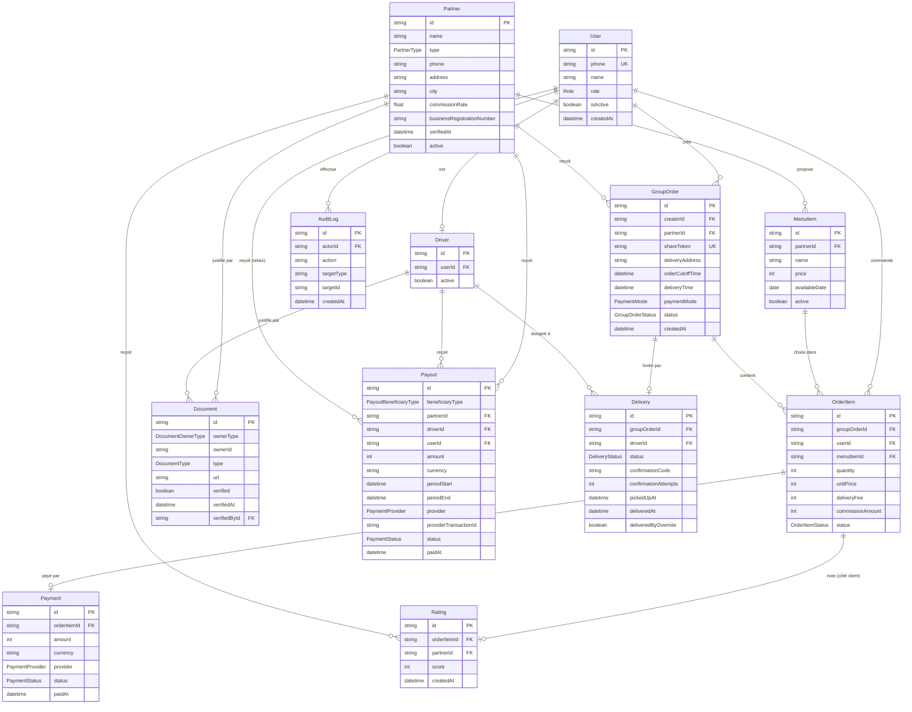

# Schéma de données — Phase 1

Conventions reprises de `citimoov-v2` : Prisma, identifiants `cuid()`, modèles en PascalCase singulier, champs en camelCase, index sur les champs filtrés fréquemment, singleton client (`lib/prisma.ts`).

**Hypothèse de simplification Phase 1** : un lien de commande groupée (`GroupOrder`) porte sur **un seul partenaire** (un restaurant ou une cuisinière, avec son menu du jour) — pas un panier mélangeant plusieurs partenaires. C'est le relais qui choisit le partenaire du jour en créant le lien. Ça garde le schéma et le workflow de réception simples ; mélanger plusieurs partenaires dans un même lien pourra être envisagé plus tard si la demande le justifie. Rien n'empêche en revanche **plusieurs liens actifs en parallèle pour le même immeuble** (un par sous-groupe de collègues aux goûts différents, ou un par relais) — la contrainte porte sur un lien donné, pas sur l'immeuble entier.

## Deux principes qui structurent ce schéma

**1. L'argent doit être traçable de bout en bout, et TocToc ne doit jamais devenir un porte-monnaie non déclaré.** Jusqu'ici, le schéma ne décrivait que l'argent qui *entre* (`Payment`, le client paie). Il manquait tout ce qui *sort* — ce que TocToc doit à un partenaire, à un livreur, à un relais — sans quoi personne ne peut répondre à "combien doit-on à Aïcha cette semaine, et le lui a-t-on versé ?". C'est aussi la traduction concrète du risque déjà identifié dans [05-risques.md](05-risques.md) : TocToc ne détient pas de licence de monnaie électronique, donc chaque mouvement doit rester attribuable à une transaction précise chez un émetteur agréé (mobile money), jamais à un solde interne que TocToc gérerait lui-même. `Payment` (entrées) et `Payout` (sorties, ajouté plus bas) forment ensemble ce registre — pas besoin d'une table de "grand livre" séparée tant que le volume reste à l'échelle de la Phase 1 ; ça deviendra pertinent si la réconciliation comptable l'exige plus tard.

**2. Le schéma doit survivre aux phases suivantes sans réécriture.** Concrètement : une commande individuelle en Phase 3 (grand public, sans groupe à recruter) n'est pas un objet différent d'une commande groupée — c'est juste un `GroupOrder` que personne d'autre ne rejoint. Aucune nouvelle table n'est nécessaire pour ça. Ce qui, en revanche, demandera vraiment un nouveau modèle plus tard : l'avantage-repas de la Phase 4 (un employeur qui crédite un portefeuille — un concept qui n'existe pas encore ici, volontairement, voir [02-strategie-differenciation.md](02-strategie-differenciation.md)). Ce que ce schéma fait *dès maintenant* pour rester extensible sans tout casser : un taux de commission **par partenaire** plutôt que codé en dur (`Partner.commissionRate`), et des documents de conformité génériques (`Document`) plutôt qu'un champ ad hoc par type de justificatif.

## Diagramme



## Schéma Prisma

```prisma
enum Role {
  CLIENT
  DRIVER
  ADMIN_PLATFORM
}

enum PartnerType {
  RESTAURANT
  CUISINE_MAISON
}

enum GroupOrderStatus {
  OPEN          // encore ouvert, on peut rejoindre
  CLOSED        // heure limite passée, récap envoyé au partenaire
  IN_DELIVERY   // livreur en route
  DELIVERED
  CANCELLED
}

enum OrderItemStatus {
  PENDING_PAYMENT
  CONFIRMED  // compte dans la liste en direct et dans le récap partenaire — ne veut pas dire "argent encaissé", voir Payment.status pour ça
  CANCELLED
}

enum PaymentProvider {
  MOBILE_MONEY
  CASH  // jamais utilisé par Payment en Phase 1 (voir plus bas) — gardé pour Payout, TocToc peut verser un livreur ou un relais en espèces localement
}

enum PaymentMode {
  SPLIT      // chacun paie sa propre part — le défaut
  HOST_PAYS  // le créateur du lien paie pour tout le groupe en une fois, à l'heure limite — voir 09-workflows.md
}

enum PaymentStatus {
  PENDING
  CONFIRMED
  FAILED
}

enum DeliveryStatus {
  ASSIGNED
  PICKED_UP
  DELIVERED
}

enum DocumentOwnerType {
  PARTNER
  DRIVER
}

enum DocumentType {
  ID_CARD                  // pièce d'identité (Driver)
  DRIVER_LICENSE           // permis de conduire (Driver)
  VEHICLE_REGISTRATION     // carte grise de la moto (Driver)
  BUSINESS_REGISTRATION    // registre de commerce, s'il existe (Partner) — reste optionnel, beaucoup de cuisinières n'en ont pas
  HEALTH_CERTIFICATE       // justificatif d'hygiène si disponible (Partner)
}

enum PayoutBeneficiaryType {
  PARTNER
  DRIVER
  RELAIS
}

model User {
  id                String       @id @default(cuid())
  phone             String       @unique
  name              String
  role              Role         @default(CLIENT)
  isActive          Boolean      @default(true)
  createdAt         DateTime     @default(now())
  updatedAt         DateTime     @updatedAt
  driver            Driver?
  createdOrders     GroupOrder[] @relation("GroupOrderCreator")
  orderItems        OrderItem[]
  relaisPayouts     Payout[]     @relation("RelaisPayouts")     // incitatif versé quand ce User a joué le rôle de relais
  documentsVerified Document[]   @relation("DocumentVerifier")  // documents partenaires/livreurs que ce compte ADMIN_PLATFORM a vérifiés
  auditLogs         AuditLog[]   @relation("AuditActor")
}

model OtpCode {
  id        String   @id @default(cuid())
  phone     String
  codeHash  String   // HMAC du code, jamais le code en clair
  attempts  Int      @default(0) // essais ratés, le code est bloqué à 5
  expiresAt DateTime
  used      Boolean  @default(false)
  createdAt DateTime @default(now())

  @@index([phone, createdAt])
}

model Partner {
  id                       String       @id @default(cuid())
  name                     String
  type                     PartnerType
  phone                    String
  address                  String
  city                     String
  commissionRate           Float        @default(0.15) // par partenaire, pas codé en dur — se négocie individuellement, voir 04-modele-economique.md
  businessRegistrationNumber String?    // optionnel : beaucoup de cuisinières n'en ont pas encore, voir Document pour la suite de la vérification
  verifiedAt               DateTime?
  active                   Boolean      @default(true)
  createdAt                DateTime     @default(now())
  menuItems                MenuItem[]
  groupOrders              GroupOrder[]
  documents                Document[]   @relation("PartnerDocuments")
  payouts                  Payout[]     @relation("PartnerPayouts")
  ratings                  Rating[]
}

model MenuItem {
  id            String      @id @default(cuid())
  partnerId     String
  partner       Partner     @relation(fields: [partnerId], references: [id])
  name          String
  description   String?
  price         Int
  photoUrl      String?
  availableDate DateTime    @db.Date
  active        Boolean     @default(true)
  orderItems    OrderItem[]

  @@index([partnerId, availableDate])
}

model GroupOrder {
  id              String            @id @default(cuid())
  creatorId       String
  creator         User              @relation("GroupOrderCreator", fields: [creatorId], references: [id])
  partnerId       String
  partner         Partner           @relation(fields: [partnerId], references: [id])
  shareToken      String            @unique
  deliveryAddress String
  deliveryLat     Float?
  deliveryLng     Float?
  orderCutoffTime DateTime
  deliveryTime    DateTime
  paymentMode     PaymentMode       @default(SPLIT) // figé à la création, voir 09-workflows.md — SPLIT (chacun paie sa part) ou HOST_PAYS (le créateur paie pour tout le groupe)
  status          GroupOrderStatus  @default(OPEN)
  createdAt       DateTime          @default(now())
  orderItems      OrderItem[]
  delivery        Delivery?

  @@index([status, orderCutoffTime])
}

model OrderItem {
  id           String          @id @default(cuid())
  groupOrderId String
  groupOrder   GroupOrder      @relation(fields: [groupOrderId], references: [id])
  userId       String
  user         User            @relation(fields: [userId], references: [id])
  menuItemId   String
  menuItem     MenuItem        @relation(fields: [menuItemId], references: [id])
  quantity         Int             @default(1)
  unitPrice        Int           // copié depuis MenuItem.price au moment de la commande — ne bouge plus si le prix change ensuite
  deliveryFee      Int           // fixé au rang de cette commande sur le lien au moment où elle est créée (palier dégressif) — jamais recalculé après coup, voir 04-modele-economique.md
  commissionAmount Int           // copié depuis Partner.commissionRate × unitPrice × quantity au moment de la commande — si le partenaire renégocie son taux ensuite, l'historique ne bouge pas
  status       OrderItemStatus @default(PENDING_PAYMENT)
  createdAt    DateTime        @default(now())
  payment      Payment?
  rating       Rating?

  @@index([groupOrderId])
}

// Note volontairement légère : un score, pas un avis textuel à modérer.
// partnerId est dupliqué depuis OrderItem (via GroupOrder) pour que la moyenne d'un
// partenaire se calcule sans remonter trois relations à chaque affichage — même logique
// de dénormalisation assumée que unitPrice/deliveryFee/commissionAmount ailleurs.
model Rating {
  id          String   @id @default(cuid())
  orderItemId String   @unique
  orderItem   OrderItem @relation(fields: [orderItemId], references: [id])
  partnerId   String
  partner     Partner  @relation(fields: [partnerId], references: [id])
  score       Int      // 1 à 5 — représenté en étoiles ou en emoji côté produit, peu importe ici
  createdAt   DateTime @default(now())

  @@index([partnerId])
}

model Payment {
  id                    String          @id @default(cuid())
  orderItemId           String          @unique
  orderItem             OrderItem       @relation(fields: [orderItemId], references: [id])
  amount                Int
  currency              String          @default("GNF") // figé par paiement — la Guinée n'est pas en zone XOF comme les 3 autres pays cibles, voir 01-marche-et-concurrence.md
  provider              PaymentProvider
  providerTransactionId String?
  status                PaymentStatus   @default(PENDING)
  paidAt                DateTime?
  createdAt             DateTime        @default(now())
}

model Driver {
  id         String     @id @default(cuid())
  userId     String     @unique
  user       User       @relation(fields: [userId], references: [id])
  active     Boolean    @default(true)
  deliveries Delivery[]
  documents  Document[] @relation("DriverDocuments")
  payouts    Payout[]   @relation("DriverPayouts")
}

model Delivery {
  id                  String         @id @default(cuid())
  groupOrderId        String         @unique
  groupOrder          GroupOrder     @relation(fields: [groupOrderId], references: [id])
  driverId            String?
  driver              Driver?        @relation(fields: [driverId], references: [id])
  status              DeliveryStatus @default(ASSIGNED)
  confirmationCode    String?        // généré au passage à PICKED_UP, révélé sur la page du lien à ce moment-là seulement — voir 09-workflows.md
  confirmationAttempts Int           @default(0) // limité à 5, pattern Redis rate-limit décrit en 07-architecture-mvp.md
  pickedUpAt          DateTime?
  deliveredAt         DateTime?
  deliveredByOverride Boolean        @default(false) // true si confirmée manuellement par ADMIN_PLATFORM plutôt que par code — toujours accompagné d'un AuditLog
}

model Document {
  id            String            @id @default(cuid())
  ownerType     DocumentOwnerType
  partnerId     String?
  partner       Partner?          @relation("PartnerDocuments", fields: [partnerId], references: [id])
  driverId      String?
  driver        Driver?           @relation("DriverDocuments", fields: [driverId], references: [id])
  type          DocumentType
  url           String
  verified      Boolean           @default(false)
  verifiedAt    DateTime?
  verifiedById  String?
  verifiedBy    User?             @relation("DocumentVerifier", fields: [verifiedById], references: [id])
  createdAt     DateTime          @default(now())

  @@index([ownerType, partnerId])
  @@index([ownerType, driverId])
}

// Ce que TocToc verse à un tiers — le pendant "sortant" de Payment (qui capte l'"entrant").
// Volontairement agrégé par période plutôt que ligne par ligne : le détail se recalcule
// à la demande depuis OrderItem/Delivery pour la période donnée, pas besoin d'une table
// de jointure supplémentaire tant que le volume reste à l'échelle de la Phase 1.
model Payout {
  id                    String                 @id @default(cuid())
  beneficiaryType       PayoutBeneficiaryType
  partnerId             String?
  partner               Partner?               @relation("PartnerPayouts", fields: [partnerId], references: [id])
  driverId              String?
  driver                Driver?                @relation("DriverPayouts", fields: [driverId], references: [id])
  userId                String?                // relais — c'est un User, pas un Partner ni un Driver
  user                  User?                  @relation("RelaisPayouts", fields: [userId], references: [id])
  amount                Int
  currency              String                 @default("GNF")
  periodStart           DateTime
  periodEnd             DateTime
  provider              PaymentProvider
  providerTransactionId String?
  status                PaymentStatus          @default(PENDING)
  paidAt                DateTime?
  createdAt             DateTime               @default(now())

  @@index([beneficiaryType, status])
}

model AuditLog {
  id         String   @id @default(cuid())
  actorId    String
  actor      User     @relation("AuditActor", fields: [actorId], references: [id])
  action     String   // ex. "document.verified", "delivery.driver_assigned", "order_item.refunded"
  targetType String   // ex. "Document", "Delivery", "OrderItem"
  targetId   String
  metadata   Json?
  createdAt  DateTime @default(now())

  @@index([targetType, targetId])
}
```

## Notes de conception

- **Source de vérité : `platform/apps/api/prisma/schema.prisma`.** Le bloc ci-dessus est le raisonnement de conception ; en cas d'écart, c'est le fichier du dépôt qui fait foi. Écarts déjà assumés : Prisma 7 (l'URL de la base vit dans `prisma.config.ts`, plus dans le schéma), un index sur `Payment.providerTransactionId` (le webhook mobile money retrouve le paiement par cette référence), et des index sur `GroupOrder.creatorId`, `OrderItem.userId` et `Delivery(driverId, status)`.
- **`OtpCode` : le code n'est jamais stocké, seulement son HMAC (`codeHash`), et chaque essai raté est compté (`attempts`).** Décidé en construisant l'auth, en corrigeant trois faiblesses vues dans CityMoov : code en clair en base, aucune limite d'essais à la vérification (6 chiffres = 1 million de combinaisons, devinables), et plusieurs codes actifs en même temps. Ici : HMAC-SHA256 avec un secret côté serveur (une fuite de la base seule ne livre pas les codes), blocage à 5 essais (la limite du doc 09 pour le code de livraison, même esprit), un seul code actif par numéro (en demander un nouveau invalide l'ancien), consommation atomique (`UPDATE … WHERE used = false`, un seul appel gagne).
- **Tous les montants sont des `Int`, jamais des `Float` (décidé au démarrage du développement).** Le GNF n'a pas de sous-unité, et `Float` accumule des erreurs d'arrondi dès qu'on additionne des paiements (un `Payout` agrégé sur une semaine ne doit jamais avoir un franc d'écart avec la somme des `Payment`). Seuls restent en `Float` : `Partner.commissionRate` (un ratio, pas un montant) et les coordonnées GPS. Conséquence à l'implémentation : `commissionAmount = Math.round(unitPrice × quantity × commissionRate)` — l'arrondi est explicite, à un seul endroit (`services/pricing`), et testé. Un test (`tests/lib/schema.test.ts`) empêche de réintroduire un `Float` monétaire par inadvertance.
- **`unitPrice` copié sur `OrderItem`** : si le partenaire change son prix le lendemain, les commandes déjà passées ne doivent pas bouger rétroactivement — même logique que `Trip.estimatedPrice` figé dans CityMoov.
- **`shareToken` sur `GroupOrder`** : c'est littéralement le lien partagé (`toctoc.app/g/{shareToken}`) — généré aléatoirement, pas l'id interne, pour ne pas exposer d'information séquentielle.
- **Pas de mot de passe sur `User`** : rejoindre par téléphone suffit en Phase 1 (structure d'auth reprise de `routes/auth.ts` dans CityMoov, disponible pour le `relais` qui revient chaque jour) — mais **un participant qui rejoint un lien une seule fois n'a pas besoin de vérifier son OTP TocToc**, voir [06-fonctionnalite-lancement.md](06-fonctionnalite-lancement.md) : son numéro sert uniquement à initier le paiement mobile money, dont l'opérateur fait déjà sa propre vérification (USSD/PIN). Le `User` correspondant peut être créé silencieusement à la première commande, sans étape de vérification bloquante.
- **`Payment` indépendant par `OrderItem`** : chaque participant paie sa propre part séparément — c'est la traduction directe en base du principe posé dans [05-risques.md](05-risques.md) (pas de paiement collectif bloquant).
- **Pas de table `Company`/`Employer`** : conforme à la décision produit — ce n'est pas l'entreprise qui paie ou qui a un compte, voir [00-vision.md](00-vision.md).
- **`PaymentProvider` réduit à `MOBILE_MONEY` / `CASH`** : on ne distingue pas l'opérateur (Orange Money, Wave...) au niveau du schéma — cette information, si elle est utile un jour (réconciliation comptable, par exemple), peut être déduite de `providerTransactionId` sans complexifier l'énumération. **Décision produit : `Payment.provider` vaut toujours `MOBILE_MONEY` en Phase 1** — pas de paiement en espèces accepté côté client, jugé trop compliqué à fiabiliser pour un début (pas d'encaissement garanti, risque de no-show — voir l'ancienne version de ce risque, retirée, dans l'historique de [05-risques.md](05-risques.md)). `CASH` reste dans l'énumération uniquement parce que `Payout` (les versements de TocToc vers un partenaire, un livreur ou un relais) peut légitimement se faire en espèces localement — les deux usages du même enum n'ont pas à rester synchronisés.
- **`Role.ADMIN_PLATFORM`** : le compte de l'équipe TocToc elle-même — c'est ce rôle qui effectue les actions manuelles décrites dans [09-workflows.md](09-workflows.md) (suivre la confirmation d'un partenaire, assigner un livreur à une livraison). Distinct de `CLIENT` (participant à une commande groupée) et `DRIVER` (livreur).
- **`deliveryFee` copié sur `OrderItem`, comme `unitPrice`** : au moment où une commande est créée, le backend compte le nombre d'`OrderItem` déjà existants (statut différent de `CANCELLED`) sur ce `GroupOrder`, en déduit le palier applicable (voir [04-modele-economique.md](04-modele-economique.md)), et fige le montant. Si une commande est annulée ensuite, les paliers déjà attribués aux autres ne bougent pas rétroactivement — seul compte le rang au moment de la commande, jamais recalculé après coup.
- **`Payment.amount` = `(OrderItem.unitPrice × OrderItem.quantity) + OrderItem.deliveryFee`** : le paiement couvre le plat et la part de livraison de cette personne en une seule transaction mobile money, pas deux paiements séparés.
- **`Payment.currency`** : figé par transaction, pas déduit dynamiquement — la Guinée (GNF) et les trois autres pays cibles (XOF) ne partagent pas la même devise ; sans ce champ, toute agrégation financière multi-pays en Phase 2 serait fausse silencieusement.
- **`OrderItemStatus.CONFIRMED` (renommé depuis `PAID`) veut dire "argent réellement encaissé", sans exception, depuis que le cash n'est plus accepté côté client** — `Payment` passe `PENDING` → `CONFIRMED` via le webhook de l'opérateur mobile money, et `OrderItem` ne passe à `CONFIRMED` qu'*après* cette confirmation, jamais avant. **C'est une règle sans exception, volontairement** : si une personne ne paie pas alors que ses collègues sur le même lien paient, son `OrderItem` reste `PENDING_PAYMENT` (ou passe `CANCELLED` si le paiement échoue) — elle n'apparaît jamais dans le récapitulatif envoyé au partenaire, et ne reçoit donc pas de repas. La distinction "engagement vs encaissement" qui existait pour le cash (gardée dans l'historique de ce document) n'a plus lieu d'être : un seul chemin, un seul sens à `CONFIRMED`. **`GroupOrder.paymentMode = HOST_PAYS` ne rouvre pas cette règle** — voir la note dédiée ci-dessous.
- **`GroupOrder.paymentMode`, deux façons de payer, sans jamais mentir sur ce qui est réellement encaissé** : en `SPLIT` (le défaut), le mécanisme est celui décrit juste au-dessus. En `HOST_PAYS`, le créateur du lien paie pour tout le groupe en une seule transaction mobile money, déclenchée à l'heure limite une fois le total connu (même job que la clôture, `groupOrderClosingWorker`, voir [09-workflows.md](09-workflows.md)) — pas de raison de faire payer chaque participant puis rembourser tout le monde. Le point délicat : entre le moment où un collègue choisit son plat et l'heure limite, son `OrderItem` reste `PENDING_PAYMENT` (aucune violation de la règle ci-dessus), mais il apparaît quand même sur la liste en direct, marqué explicitement "en attente du règlement de [créateur]" plutôt que confondu avec un `OrderItem` réellement payé. Ce n'est qu'une fois la charge unique du créateur confirmée que tous ces `OrderItem` basculent ensemble à `CONFIRMED`, chacun gardant son propre `Payment` (donc son propre `unitPrice`/`deliveryFee`/`commissionAmount` pour la compta), mais tous avec le **même** `providerTransactionId` — une seule transaction réelle, plusieurs lignes `Payment` qui la référencent. Si cette charge unique échoue, tous les `OrderItem` du lien passent `CANCELLED` ensemble — un risque de concentration assumé et documenté dans [05-risques.md](05-risques.md), pas une faille silencieuse.
- **`Partner.commissionRate` par partenaire, pas une constante globale** : deux partenaires peuvent négocier des taux différents (une cuisinière à faible marge peut avoir besoin d'un taux plus bas qu'un restaurant établi) sans toucher au code. `OrderItem.commissionAmount` copie ce taux appliqué à `unitPrice × quantity` au moment de la commande — comme `unitPrice`, il ne bouge plus si `Partner.commissionRate` change ensuite pour de futures commandes.
- **`Payout` est le pendant sortant de `Payment`** : `Payment` capte ce qu'un client verse à TocToc (via un opérateur mobile money agréé, jamais un solde interne — voir le risque réglementaire dans [05-risques.md](05-risques.md)) ; `Payout` capte ce que TocToc reverse ensuite à un partenaire, un livreur ou un relais, avec la même rigueur (fournisseur, référence de transaction, statut, devise). Sans cette table, il n'existe aucune trace de "combien doit-on à Aïcha cette semaine, et l'a-t-on payée" — un vrai trou de conformité, pas seulement un détail opérationnel. Agrégé par période (`periodStart`/`periodEnd`) plutôt que ligne par ligne : le détail se recalcule à la demande depuis `OrderItem` (pour un partenaire ou un relais) ou `Delivery` (pour un livreur) sur cette période.
- **`Document` et `AuditLog` sont volontairement génériques** : un seul modèle de document pour tous les types de justificatifs (pièce d'identité, permis, registre de commerce...) plutôt qu'un champ par type sur `Partner`/`Driver` — ajouter un nouveau type de document plus tard (ex. une assurance livreur) ne demande qu'une valeur d'enum, pas une migration de schéma. Même logique pour `AuditLog` : une seule table pour tracer toute action `ADMIN_PLATFORM` sensible (vérification de document, remboursement manuel, assignation de livreur), avec `targetType`/`targetId` génériques plutôt qu'une table de log par entité — repris du pattern `AdminAuditLog` déjà utilisé dans CityMoov.
- **Extensibilité vers la Phase 3 sans migration** : une commande individuelle grand public n'est qu'un `GroupOrder` que personne d'autre ne rejoint — même `OrderItem`, même `Payment`, même `Delivery`. Le produit change (plus de lien à partager), pas le schéma.
- **`Delivery.confirmationCode`** : la preuve qu'une livraison a réellement eu lieu, pas seulement qu'un livreur a cliqué un bouton — voir le détail du mécanisme dans [09-workflows.md](09-workflows.md). Généré au passage à `PICKED_UP`, jamais avant (réduit la fenêtre où il pourrait fuiter). `confirmationAttempts` plafonne les essais du livreur (5, au-delà l'app le bloque) pour qu'un code à 4 chiffres ne se devine pas par force brute. `deliveredByOverride` distingue une livraison confirmée normalement d'une confirmation manuelle forcée par `ADMIN_PLATFORM` — cette dernière doit toujours s'accompagner d'une entrée `AuditLog`, jamais silencieuse.
- **`Rating`, un score par commande, pas un système d'avis à modérer** : chaque `OrderItem` peut recevoir une note du partenaire (1 à 5). **La raison d'être est d'abord opérationnelle** : c'est un signal de qualité continu et peu coûteux sur chaque partenaire, qui vient renforcer le suivi manuel déjà prévu pour le risque de capacité/régularité ([05-risques.md](05-risques.md)) et aide le relais à choisir sereinement un partenaire la fois suivante. L'affichage en agrégat sur la page du lien, une fois la livraison faite ([09-workflows.md](09-workflows.md)), en fait aussi un moment agréable pour le groupe — mais c'est un bénéfice secondaire, pas la raison de construire la fonctionnalité. Volontairement léger : pas de texte libre à modérer, pas de photo à héberger, juste un chiffre. `partnerId` est dupliqué sur `Rating` (déductible via `OrderItem → GroupOrder → Partner`) pour calculer une moyenne sans remonter trois relations à chaque affichage — même logique de dénormalisation assumée que `unitPrice` ou `deliveryFee`.
