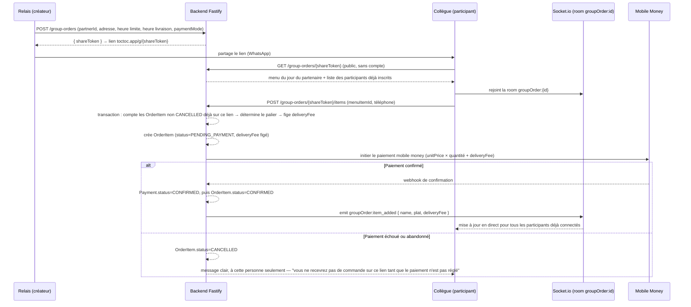
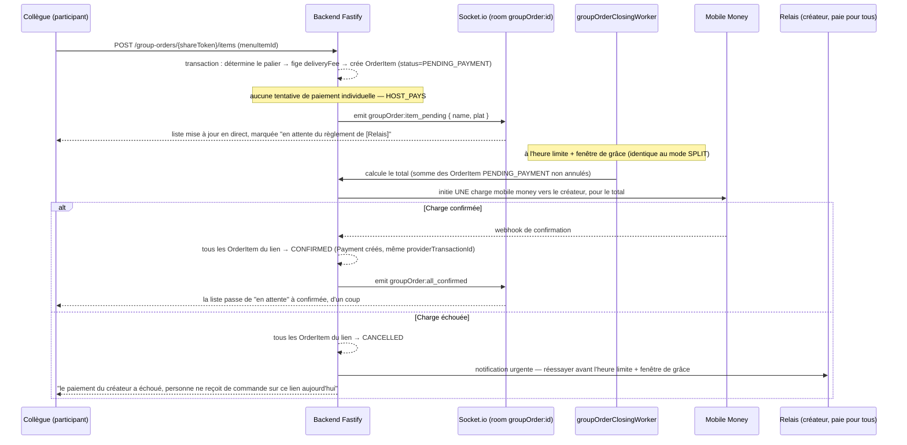
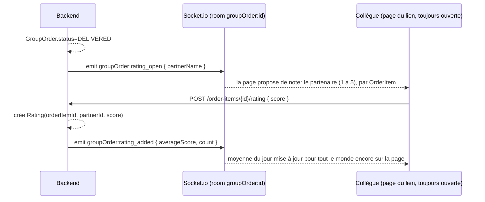

# Workflows — achat, réception de commande, livraison, notation

Quatre workflows, alignés sur le schéma de [08-schema-donnees.md](08-schema-donnees.md) et l'architecture de [07-architecture-mvp.md](07-architecture-mvp.md). Les patterns de temps réel (Socket.io, rooms) et de tâches planifiées (BullMQ) sont ceux déjà utilisés dans `citimoov-v2`.

## 1. Achat — créer, rejoindre, choisir, payer

À la création du lien, le relais choisit le `paymentMode` ([08-schema-donnees.md](08-schema-donnees.md)) : `SPLIT` (chacun paie sa part, décrit ci-dessous) ou `HOST_PAYS` (le créateur paie pour tout le groupe, décrit dans la variante plus bas). C'est exactement ce que proposent déjà DoorDash et Uber Eats sur leurs commandes groupées ("Guests pay for themselves" vs. le créateur qui règle l'ensemble — voir [10-benchmark-produit-mondial.md](10-benchmark-produit-mondial.md)) : un patron qui veut offrir le déjeuner à son équipe, ou un collègue qui veut inviter les autres, peut le faire dès la création du lien, sans que ça change quoi que ce soit pour les autres modules du produit (menu, tarif dégressif, livraison, code de confirmation, notation).

### Mode SPLIT (par défaut) — chacun paie sa part



**Le point technique qui porte l'effet waouh** ([06-fonctionnalite-lancement.md](06-fonctionnalite-lancement.md)) : dès qu'un `OrderItem` passe à `CONFIRMED`, le backend émet `groupOrder:item_added` sur la room `groupOrder:{id}` — exactement le pattern `emitToTrip` de CityMoov (`websocket/events.ts`), appliqué à un lien au lieu d'une course. Chaque navigateur déjà ouvert sur le lien voit la liste se mettre à jour sans recharger la page.

**`CONFIRMED` veut dire "argent réellement encaissé", sans exception** ([08-schema-donnees.md](08-schema-donnees.md)) : seul le paiement mobile money est accepté côté client (décision produit — pas de cash, jugé trop compliqué à fiabiliser pour un début), donc `OrderItem` ne passe jamais à `CONFIRMED` avant que `Payment` le soit. Conséquence directe et volontaire : si une personne ne paie pas alors que ses collègues sur le même lien paient, elle n'apparaît jamais dans la liste que le groupe voit, et ne reçoit donc pas de repas — mais elle voit, elle, l'état réel de sa propre commande (voir [06-fonctionnalite-lancement.md](06-fonctionnalite-lancement.md)).

**Le palier de livraison est déterminé une fois, à la création de l'`OrderItem`, jamais recalculé ensuite** : le rang se lit en comptant les `OrderItem` déjà existants sur ce `GroupOrder` (hors `CANCELLED`) au moment précis de la requête. Deux commandes envoyées au même instant doivent être sérialisées (transaction avec verrou, ou contrainte au niveau de la base) pour éviter que deux participants se voient attribuer le même rang.

### Variante : `paymentMode = HOST_PAYS` — le créateur paie pour tout le groupe



**Ce que ce mode ne change pas** : le tarif dégressif par palier ([04-modele-economique.md](04-modele-economique.md)) s'applique toujours à chaque `OrderItem`, exactement comme en `SPLIT` — c'est juste le créateur qui règle la somme de tous les tarifs individuels en une fois, pas chaque participant. Le menu, le code de confirmation de livraison, la notation : rien ne change en aval de l'achat.

**Ce que ce mode change vraiment — un risque de concentration assumé** : en `SPLIT`, un paiement qui échoue n'affecte que la personne concernée. En `HOST_PAYS`, un seul paiement représente tout le groupe — s'il échoue, tout le monde perd sa commande d'un coup. C'est un compromis conscient, pas un oubli : voir la parade dans [05-risques.md](05-risques.md).

**Rappel avant l'heure limite** : un job planifié (voir `reminderWorker`, même famille que `scheduledTripsWorker`) scanne les `GroupOrder` en statut `OPEN` dont `orderCutoffTime` approche, et envoie un rappel — par WhatsApp souhaité en priorité, SMS en secours. Voir la correction dans [07-architecture-mvp.md](07-architecture-mvp.md) : l'envoi WhatsApp n'est pas un pattern déjà prêt chez CityMoov, il reste à construire.

**Clôture automatique, avec une fenêtre de grâce pour les paiements en cours** : un second job (`groupOrderClosingWorker`) scanne les `GroupOrder` dont `orderCutoffTime` est dépassée, pour les deux modes de paiement. En `SPLIT`, un paiement mobile money initié juste avant l'heure limite peut être confirmé par le webhook juste après — sans précaution, ce participant paierait pour une commande dont le partenaire n'a jamais entendu parler. En `HOST_PAYS`, c'est le même job qui déclenche la charge unique au créateur, décrite plus haut. Règle retenue dans les deux cas : le job attend une **fenêtre de grâce de 2 minutes** après `orderCutoffTime` avant de figer le récapitulatif ; toute commande encore `PENDING_PAYMENT` passé ce délai est annulée automatiquement (remboursement si le débit a quand même eu lieu en `SPLIT`), et la personne est invitée à rejoindre le lien du lendemain. Une fois la fenêtre passée, le `GroupOrder` passe à `CLOSED` et déclenche le workflow de réception ci-dessous. **Si aucun `OrderItem` n'est `CONFIRMED`** (personne n'a payé en `SPLIT`, ou la charge du créateur a échoué en `HOST_PAYS`), le `GroupOrder` passe directement à `CANCELLED` sans notifier le partenaire ni créer de `Delivery`.

## 2. Réception de la commande — côté partenaire

Pas d'application dédiée pour le partenaire en Phase 1 (voir [07-architecture-mvp.md](07-architecture-mvp.md)) — le partenaire reçoit un message, il ne se connecte à rien.

```mermaid
sequenceDiagram
    participant Job as groupOrderClosingWorker
    participant API as Backend
    participant Partenaire as Partenaire (restaurant/cuisinière)
    participant Ops as Équipe TocToc (compte Role.ADMIN_PLATFORM)

    Job->>API: GroupOrder.orderCutoffTime dépassée + fenêtre de grâce écoulée → status=CLOSED
    API-->>API: agrège les OrderItem CONFIRMED par plat (ex. "6x riz gras, 3x attiéké poisson")
    API->>Partenaire: envoi du récapitulatif par WhatsApp en priorité, SMS en secours (nombre de plats, heure de livraison)
    Partenaire-->>Ops: confirme la préparation par retour de message (manuel au départ)
    Note over Ops: en Phase 0/1, un opérateur suit les confirmations à la main ;<br/>automatisable plus tard si le volume par partenaire le justifie
```

**Pourquoi manuel au départ** : construire un tableau de bord partenaire est un coût disproportionné pour un ou deux partenaires pilotes qui ne sont pas nécessairement à l'aise avec une interface numérique. Le récapitulatif texte, envoyé automatiquement par le système, est suffisant tant que le nombre de partenaires reste faible — voir le principe de proportionnalité de l'architecture dans [07-architecture-mvp.md](07-architecture-mvp.md).

## 3. Livraison — un passage groupé, planifié, pas de matching temps réel

Contrairement à CityMoov (matching temps réel chauffeur ↔ course, tracking GPS), la livraison du déjeuner est **planifiée à l'avance** : pas de recherche de livreur disponible à la volée, pas de suivi GPS minute par minute — ce n'est pas ce que le produit promet. **Léger ne veut pas dire sommaire** : le livreur doit savoir précisément quoi récupérer, où livrer et à qui remettre — et TocToc doit pouvoir prouver qu'une livraison a réellement eu lieu, pas seulement qu'un livreur a appuyé sur un bouton.

### L'application livreur — le strict nécessaire, mais pas moins

Une vue web minimale (même application React que le reste du produit, un espace différent), protégée par une connexion téléphone + mot de passe (même pattern que `staff/login` dans CityMoov). Pas d'app native, pas de carte, pas de position GPS — trois écrans :

1. **Mes livraisons du jour** : la liste des `Delivery` assignées à ce livreur, triées par heure de récupération.
2. **Détail d'une livraison — avant récupération** : nom et adresse du partenaire, téléphone du partenaire, la liste agrégée des plats à récupérer (calculée depuis les `OrderItem` `CONFIRMED` du `GroupOrder`, ex. "6× riz gras, 3× attiéké poisson"), et un bouton unique **"Récupéré chez le partenaire"**.
3. **Détail d'une livraison — après récupération** : adresse de livraison, nom et téléphone du relais (point de contact sur place), et un champ pour saisir le **code de confirmation** avant de pouvoir valider — pas de bouton "Livré" qui se contente d'un clic.

```mermaid
sequenceDiagram
    participant Ops as Ops (ADMIN_PLATFORM)
    participant Driver as App livreur
    participant API as Backend
    participant WS as Socket.io (room groupOrder:id)
    participant Relais as Relais / collègues (page du lien)

    Ops->>API: assigne un livreur → Delivery créée (status=ASSIGNED)
    Driver->>API: GET mes livraisons → manifeste de récupération (plats, adresse partenaire)
    Driver->>API: POST /deliveries/{id}/picked-up
    API-->>API: Delivery.status=PICKED_UP, pickedUpAt=now, génère confirmationCode (4 chiffres)
    API->>WS: emit groupOrder:in_delivery { estimatedMinutes }
    WS-->>Relais: page mise à jour — "Livraison en route, votre code : XXXX"
    Driver->>API: POST /deliveries/{id}/confirm { code }
    alt Code correct
        API-->>API: Delivery.status=DELIVERED, deliveredAt=now ; GroupOrder.status=DELIVERED
        API->>WS: emit groupOrder:delivered
    else Code incorrect (jusqu'à 5 essais)
        API-->>Driver: erreur, réessayer
    else Après 5 essais, ou relais injoignable
        Ops->>API: confirmation manuelle forcée (AuditLog obligatoire)
    end
```

**Pourquoi un code, pas juste un bouton** : un bouton "Livré" côté livreur ne prouve rien — il peut être cliqué depuis la rue sans être jamais passé à l'adresse. Le code n'existe que sur la page que les participants ont déjà ouverte (celle du lien), révélé seulement une fois `Delivery.status = PICKED_UP` : pour le lire, il faut être physiquement avec quelqu'un du groupe. Pas de nouveau canal à construire — c'est la page "en direct" déjà bâtie pour l'effet waouh ([06-fonctionnalite-lancement.md](06-fonctionnalite-lancement.md)) qui porte aussi la preuve de livraison. Léger à construire, réel comme protection.

**Pourquoi le code est révélé au passage à `PICKED_UP`, pas avant** : le donner dès la création de la `Delivery` laisserait le temps qu'il fuite ou soit partagé par erreur avant même que le livreur ait quitté le partenaire. Le lier au retrait effectif réduit la fenêtre d'exposition et confirme, en creux, que le livreur a bien démarré sa tournée.

**Limiter les essais** : 5 tentatives de code par `Delivery`, avec le même pattern Redis `INCR`/`EXPIRE` déjà utilisé pour les endpoints sensibles ([07-architecture-mvp.md](07-architecture-mvp.md)) — un code à 4 chiffres se devine en 10 000 essais, pas en 5.

**La sortie de secours doit rester une exception tracée, pas un raccourci habituel** : si le relais est injoignable ou a perdu la page, `ADMIN_PLATFORM` peut confirmer manuellement une livraison — mais cette action crée systématiquement une entrée `AuditLog` (`action = "delivery.manual_override"`), pour qu'un usage abusif de ce contournement reste visible a posteriori plutôt que de devenir une habitude silencieuse.

**Assignation du livreur** : manuelle par l'équipe TocToc en Phase 1 (un ou deux livreurs pour deux ou trois immeubles, pas besoin d'algorithme de matching). Ce n'est pas une solution d'attente honteuse — DoorDash a livré ses 200 premières commandes à la main, Chowdeck a démarré avec trois motos et des réunions hebdomadaires pour organiser les tournées, voir [10-benchmark-produit-mondial.md](10-benchmark-produit-mondial.md). Le `GroupOrder` passe en `IN_DELIVERY` dès que la `Delivery` est créée avec un `driverId`, et en `DELIVERED` quand le code est validé (ou l'override Ops utilisé).

**Signal de bascule vers une assignation automatisée** : pas un nombre de commandes fixé à l'avance, mais un signal opérationnel concret — le jour où la personne qui assigne les livreurs ne peut plus suivre à l'œil ou sur un tableur toutes les livraisons en cours sans erreur ni retard. Avant ce point, automatiser serait résoudre un problème qu'on n'a pas encore.

## 4. Après la livraison — noter le partenaire

**Raison d'être : d'abord opérationnelle, pas sociale.** La note alimente en premier lieu le suivi de qualité des partenaires ([05-risques.md](05-risques.md)) et aide le relais à choisir sereinement la prochaine fois — l'affichage collectif sur la page du lien est un bénéfice secondaire, pas l'objectif de la fonctionnalité ([08-schema-donnees.md](08-schema-donnees.md)).



Même schéma technique que les deux moments waouh précédents : une room déjà ouverte, un événement de plus, pas un nouveau canal ([07-architecture-mvp.md](07-architecture-mvp.md)). Facultatif pour le participant — une commande non notée n'a aucune conséquence, ni pour lui ni pour le partenaire.

## Ce que ces quatre workflows n'incluent pas, volontairement

- Pas de renégociation de commande après paiement (annuler un `OrderItem` payé = remboursement manuel en Phase 1, pas de flux automatisé).
- Pas de répartition automatique des tournées entre plusieurs livreurs — à ce volume, une décision manuelle par les fondateurs est plus rapide à construire qu'un algorithme.
- Pas d'avis textuel ni de photo après livraison — seulement un score, voir [08-schema-donnees.md](08-schema-donnees.md).
