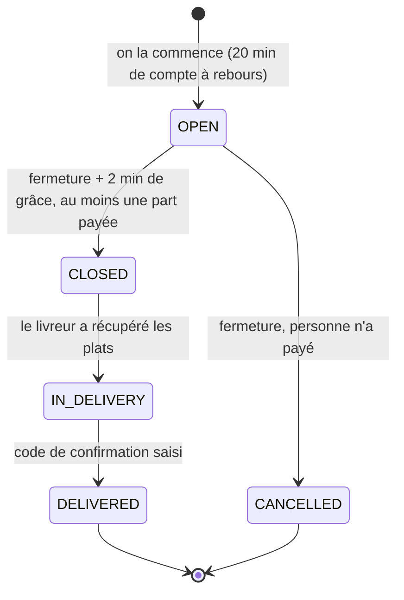

# La commande — l'objet au centre de tout

Tout dans TocToc tourne autour d'**une seule chose : la commande**. Le restaurant, les participants, le compte à rebours, le tarif qui baisse, le paiement, le récap envoyé au partenaire, la livraison, la note : tout s'accroche à elle. Le **lien** n'est que sa porte d'entrée — l'adresse qu'on partage pour que d'autres la rejoignent.

Ce document est le point de départ : il dit ce qu'est une commande, quelles règles la gouvernent, comment elle vit, et ce qui s'y rattache. Les autres documents détaillent chaque aspect ([06](06-fonctionnalite-lancement.md) le parcours, [08](08-schema-donnees.md) les données, [09](09-workflows.md) les flux).

## Ce qu'est une commande

Une commande, c'est :

- **un restaurant** (ou une cuisinière) — un seul ;
- **une adresse de livraison** ;
- **une personne qui la commence**, et **des participants** qui la rejoignent (aucun, si on commande seul) ;
- **une part par participant** : son plat, son prix, son frais de livraison, son paiement ;
- **deux heures** : la fermeture (maintenant + 20 minutes) et la livraison estimée (fermeture + 45 minutes) ;
- **un mode de paiement** : chacun paie sa part (`SPLIT`) — ou, plus tard, le créateur paie pour tous ;
- **un statut** qui dit où elle en est.

**Seul ou en groupe, c'est la même chose** : une commande à laquelle personne d'autre n'a rejoint le lien est simplement une commande solo.

## Les règles

1. **Un restaurant par commande.** On choisit d'abord un restaurant. Qui veut un autre restaurant lance sa propre commande, que d'autres peuvent rejoindre à leur tour.
2. **N'importe qui peut en commencer une**, avec son téléphone et son nom : pas de compte obligatoire, pas de code à saisir.
3. **Le groupage ne passe que par le lien.** Pas de « groupes ouverts » proposés par l'application.
4. **Elle reste ouverte 20 minutes.** Tous ceux qui en sont doivent avoir commandé et payé dans ce délai. Personne ne choisit d'heure.
5. **La livraison est estimée 45 minutes après la fermeture** (préparation et trajet).
6. **On commande de 9h à minuit**, si la livraison peut avoir lieu avant minuit. Le restaurant doit être ouvert quand il reçoit la commande, et avoir un menu ce jour-là.
7. **Chacun paie sa part**, indépendamment des autres, en mobile money. Une part n'existe pour le groupe qu'une fois payée.
8. **Le tarif de livraison baisse avec le rang de la part** dans la commande, et ne change jamais pour ceux qui ont déjà commandé.
9. **Deux commandes non coordonnées chez le même restaurant, ce n'est pas un bug** : chacune paie le premier palier. C'est voulu, ça pousse à se passer le mot.

## Sa vie

| Statut | Ce qui se passe | Construit ? |
| --- | --- | --- |
| `OPEN` | On peut la rejoindre, choisir son plat et payer. Le groupe voit la liste se remplir en direct. | oui |
| `CLOSED` | L'heure est passée. Les parts encore en attente de paiement sont annulées ; **les plats payés sont validés** et le récap part chez le restaurant. | oui (mode `SPLIT`) |
| `CANCELLED` | L'heure est passée et **personne n'a payé** : elle expire, rien n'est envoyé au restaurant, **il faut recommencer à zéro** (nouvelle commande, nouveau lien). | oui (mode `SPLIT`) |
| `IN_DELIVERY` | Un livreur est en route ; le groupe voit un code à lui donner à l'arrivée. | oui |
| `DELIVERED` | Le code a été saisi : la livraison est prouvée. On peut noter le restaurant (pas encore construit). | oui |

Une commande expirée ne se rouvre jamais. Pour la refaire, on en commence une nouvelle : même restaurant, même adresse, en un geste.

## Ce qui s'y rattache

| Ce qu'on voit | Ce que c'est dans le système | Où c'est décrit |
| --- | --- | --- |
| La commande | `GroupOrder` | [08](08-schema-donnees.md) |
| Son restaurant | `Partner` (restaurant ou cuisinière) et son menu du jour | [08](08-schema-donnees.md) |
| Le lien à partager | `shareToken` : `toctoc.app/g/{jeton}` | [06](06-fonctionnalite-lancement.md) |
| La part de chacun | `OrderItem` : plat, quantité, prix, frais de livraison et commission figés | [08](08-schema-donnees.md) |
| Le paiement d'une part | `Payment`, un par part | [08](08-schema-donnees.md), [09](09-workflows.md) |
| Le compte à rebours | `orderCutoffTime` | [09](09-workflows.md) |
| La liste qui se remplit | temps réel, une « room » par commande | [07](07-architecture-mvp.md) |
| Le récap du restaurant | envoyé à la fermeture | [09](09-workflows.md) |
| La livraison | `Delivery` : livreur, code de confirmation | [09](09-workflows.md) |
| La note | `Rating`, une par part | [08](08-schema-donnees.md) |

## Vocabulaire

À employer partout, dans les écrans comme dans les échanges :

| On dit | On ne dit pas | Dans le code |
| --- | --- | --- |
| **commande** | groupe, panier, session | `GroupOrder`, `/group-orders` |
| **lien** (pour la partager) | — | `shareToken` |
| **part** (celle d'un participant) | ligne, item | `OrderItem` |
| **commencer** une commande | créer un groupe | `POST /group-orders` |
| **rejoindre** une commande | s'inscrire | `POST /group-orders/:jeton/items` |
| **restaurant** (ou cuisinière) | partenaire, vendeur | `Partner` |

Le mot **relais** ne désigne plus qu'un rôle : la personne qui commence des commandes chaque jour dans un bureau et reçoit un incitatif ([04](04-modele-economique.md)). N'importe qui peut commencer une commande, il n'a pas besoin d'être « relais ».

## Ce que ça change pour l'application

**La commande est au centre de chaque écran**, quel que soit le rôle :

- **Le participant** ouvre une commande : le restaurant, le compte à rebours, la liste de ceux qui en sont, le tarif du prochain arrivant, sa propre part.
- **Celui qui commence** voit ses commandes du jour, et peut refaire la même en un geste.
- **L'équipe** traite des commandes : celles qui viennent de se fermer, à confirmer chez le restaurant, à assigner à un livreur, à rembourser si un paiement est arrivé trop tard.
- **Le livreur** livre des commandes : chaque livraison est une commande, avec ses plats et son code.
- **La landing** montre une commande qui se remplit en direct, pas un catalogue de plats.
